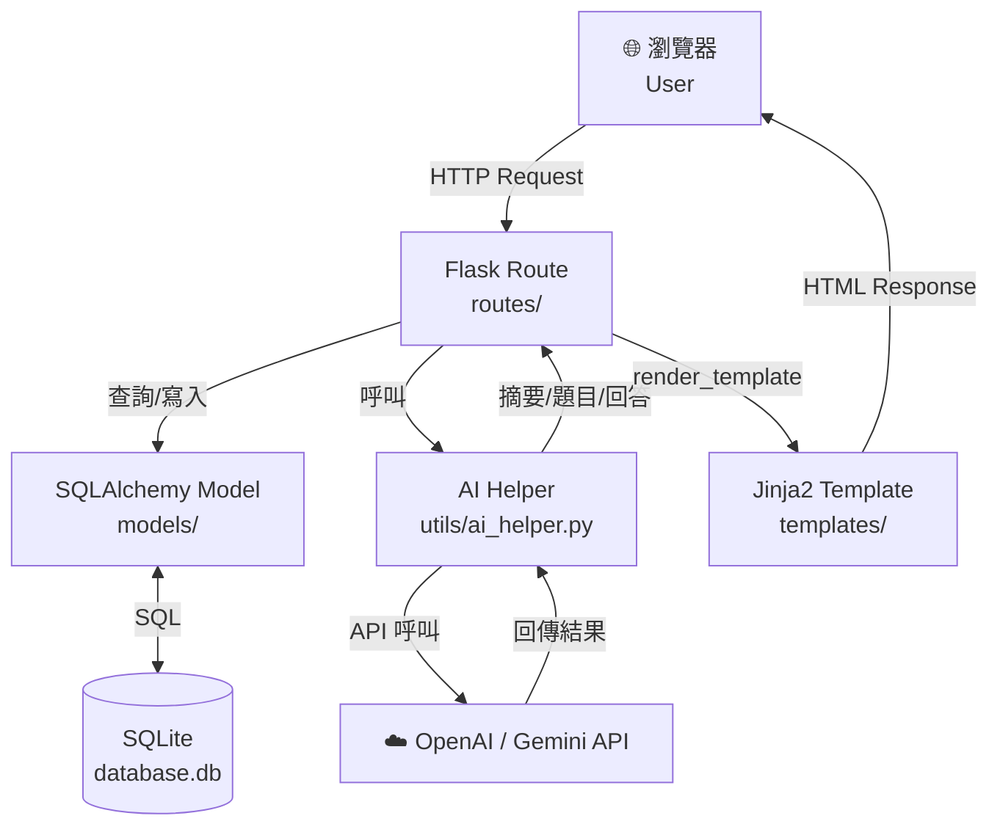
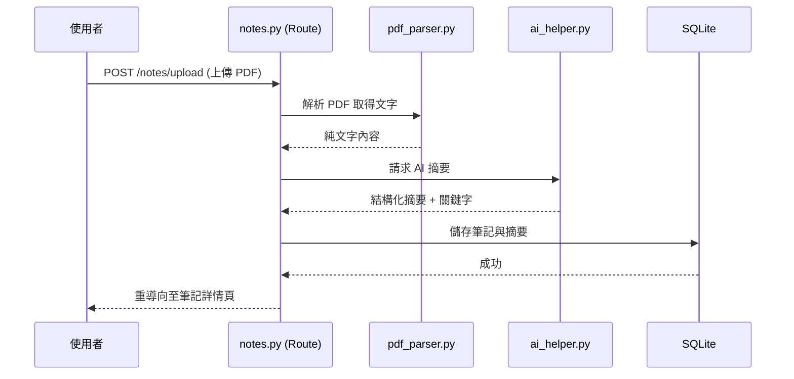
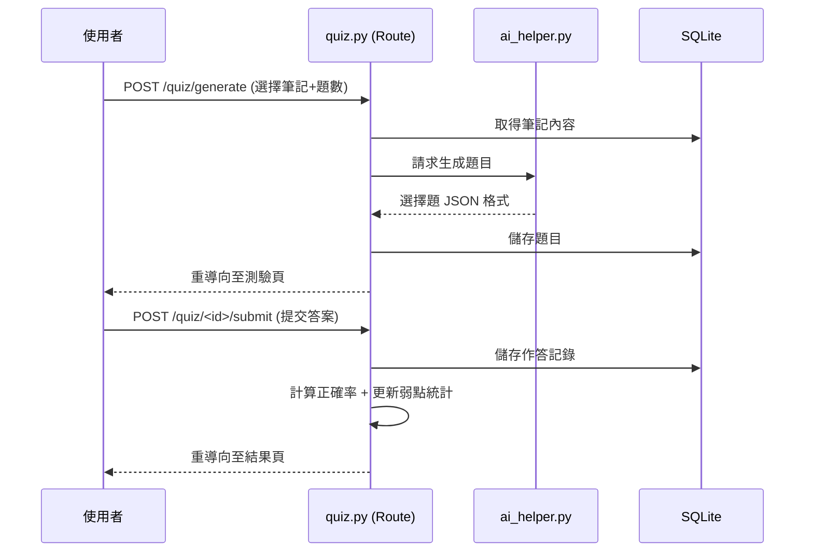

# 🏗️ ARCHITECTURE — AI 學習助理系統
> **文件版本**：v1.0  
> **建立日期**：2026-04-09  
> **對應 PRD**：docs/PRD.md v1.0

---

## 1. 技術架構說明

### 1.1 選用技術與原因

| 技術 | 版本建議 | 選用原因 |
|---|---|---|
| **Python** | 3.10+ | 生態系豐富，AI/ML 函式庫支援最完整 |
| **Flask** | 3.x | 輕量、靈活，適合中小型專案快速開發 |
| **Jinja2** | 隨 Flask | 與 Flask 無縫整合，模板語法直覺易學 |
| **SQLite** | 3.x | 零設定、單檔案資料庫，適合本地部署 |
| **SQLAlchemy** | 2.x | ORM 層讓 Model 操作更直覺，易於切換資料庫 |
| **OpenAI / Gemini API** | 最新 | 提供 GPT / Gemini 模型進行摘要、出題、問答 |
| **pdfplumber** | 最新 | 高準確度 PDF 文字解析，支援複雜排版 |
| **Flask-Login** | 最新 | 使用者認證與 Session 管理 |
| **bcrypt** | 最新 | 密碼雜湊加密，防止明文儲存 |

### 1.2 MVC 模式說明

本系統採用 Flask 的 **MVC（Model-View-Controller）** 架構：

```
┌─────────────┐     ┌─────────────────┐     ┌──────────────┐
│    Model     │     │   Controller    │     │     View     │
│  (models/)  │◄────│   (routes/)     │────►│ (templates/) │
│             │     │                 │     │              │
│ 定義資料表   │     │ 接收 HTTP 請求  │     │ Jinja2 HTML  │
│ 操作 SQLite │     │ 呼叫 Model      │     │ 呈現頁面給   │
│ 回傳資料    │     │ 呼叫 AI API     │     │ 使用者瀏覽器 │
└─────────────┘     │ 回傳資料給 View │     └──────────────┘
                    └─────────────────┘
```

| 層級 | 資料夾 | 職責 |
|---|---|---|
| **Model** | `app/models/` | 定義資料庫 Schema、提供 CRUD 方法 |
| **View** | `app/templates/` | Jinja2 HTML 模板，負責畫面渲染 |
| **Controller** | `app/routes/` | Flask 路由，處理請求邏輯、呼叫 AI API |
| **靜態資源** | `app/static/` | CSS 樣式、JavaScript、上傳的圖片檔 |

---

## 2. 專案資料夾結構

```
web_app_development/           ← 專案根目錄
│
├── app/                       ← 主應用程式套件
│   │
│   ├── __init__.py            ← Flask app 工廠函式 (create_app)
│   │
│   ├── models/                ← 資料庫模型（Model 層）
│   │   ├── __init__.py
│   │   ├── user.py            ← 使用者帳號模型
│   │   ├── subject.py         ← 科目模型
│   │   ├── note.py            ← 筆記模型（含 AI 摘要欄位）
│   │   ├── quiz.py            ← 測驗與題目模型
│   │   ├── answer.py          ← 作答記錄模型
│   │   └── chat.py            ← 問答對話記錄模型
│   │
│   ├── routes/                ← Flask 路由（Controller 層）
│   │   ├── __init__.py
│   │   ├── auth.py            ← 登入、註冊、登出路由
│   │   ├── dashboard.py       ← 學習儀表板路由
│   │   ├── subjects.py        ← 科目管理路由
│   │   ├── notes.py           ← 筆記上傳、AI 摘要路由
│   │   ├── quiz.py            ← AI 出題、測驗、批改路由
│   │   ├── analysis.py        ← 弱點分析與複習建議路由
│   │   └── chat.py            ← 語音/文字問答路由
│   │
│   ├── templates/             ← Jinja2 HTML 模板（View 層）
│   │   ├── base.html          ← 共用版型（導覽列、頁尾）
│   │   ├── auth/
│   │   │   ├── login.html
│   │   │   └── register.html
│   │   ├── dashboard/
│   │   │   └── index.html     ← 學習儀表板頁面
│   │   ├── subjects/
│   │   │   ├── index.html     ← 科目列表
│   │   │   └── detail.html    ← 科目詳情
│   │   ├── notes/
│   │   │   ├── upload.html    ← 上傳筆記頁面
│   │   │   └── detail.html    ← 筆記詳情（AI 摘要）
│   │   ├── quiz/
│   │   │   ├── generate.html  ← 設定出題條件
│   │   │   ├── take.html      ← 進行測驗
│   │   │   └── result.html    ← 測驗結果與解析
│   │   ├── analysis/
│   │   │   └── index.html     ← 弱點分析頁面
│   │   └── chat/
│   │       └── index.html     ← 語音/文字問答頁面
│   │
│   ├── static/                ← 靜態資源
│   │   ├── css/
│   │   │   └── main.css       ← 全站樣式
│   │   ├── js/
│   │   │   ├── main.js        ← 共用 JS
│   │   │   ├── quiz.js        ← 測驗互動邏輯
│   │   │   └── chat.js        ← 語音輸入 / 聊天 UI
│   │   └── uploads/           ← 使用者上傳的講義檔案
│   │
│   └── utils/                 ← 工具函式（非路由邏輯）
│       ├── ai_helper.py       ← 封裝 AI API 呼叫（摘要/出題/問答）
│       ├── pdf_parser.py      ← PDF / 圖片解析（pdfplumber / OCR）
│       └── analysis_helper.py ← 弱點計算邏輯
│
├── instance/                  ← 實例資料夾（不進版本控制）
│   └── database.db            ← SQLite 資料庫檔案
│
├── docs/                      ← 專案文件
│   ├── PRD.md
│   ├── ARCHITECTURE.md        ← 本文件
│   ├── FLOWCHART.md           ← 使用者流程圖（待產出）
│   ├── DB_SCHEMA.md           ← 資料庫設計（待產出）
│   └── API_DESIGN.md          ← 路由規劃（待產出）
│
├── tests/                     ← 測試檔案
│   ├── test_auth.py
│   ├── test_notes.py
│   └── test_quiz.py
│
├── app.py                     ← 入口程式（啟動 Flask）
├── config.py                  ← 設定檔（API Key、DB 路徑等）
├── requirements.txt           ← Python 套件清單
├── .env                       ← 環境變數（API Key，不進版本控制）
├── .gitignore
└── 實作說明.md
```

---

## 3. 元件關係圖

### 3.1 完整請求流程



### 3.2 筆記上傳與 AI 摘要流程



### 3.3 AI 出題與測驗流程



---

## 4. 關鍵設計決策

### 決策一：使用 Flask Application Factory（`create_app`）

**選擇**：在 `app/__init__.py` 中使用 `create_app()` 工廠函式。  
**原因**：
- 讓測試環境可以用不同設定初始化 app
- 避免循環 import 問題
- 符合 Flask 官方最佳實踐

```python
# app/__init__.py
def create_app(config=None):
    app = Flask(__name__)
    # 載入設定、擴充套件、藍圖...
    return app
```

---

### 決策二：路由拆分為多個 Blueprint

**選擇**：每個功能模組（auth / notes / quiz ...）各自是一個 Flask Blueprint。  
**原因**：
- 各功能模組獨立，不互相干擾
- 方便團隊分工（不同人負責不同 Blueprint）
- URL prefix 清楚（`/notes/...`, `/quiz/...`）

---

### 決策三：AI API 呼叫集中在 `utils/ai_helper.py`

**選擇**：所有 OpenAI / Gemini API 呼叫都封裝在 `ai_helper.py`，路由層不直接呼叫 API。  
**原因**：
- 未來切換 AI 廠商只需修改一個檔案
- Prompt 集中管理，方便調整
- 路由層保持簡潔，只處理 HTTP 邏輯

---

### 決策四：使用 SQLAlchemy ORM（而非裸 sqlite3）

**選擇**：透過 Flask-SQLAlchemy 操作資料庫。  
**原因**：
- 用 Python Class 定義 Schema，比手寫 SQL 直覺
- 內建防止 SQL Injection
- 未來如需升級至 PostgreSQL，只需修改連線字串

---

### 決策五：`.env` 管理 API Key，不進版本控制

**選擇**：API Key 與敏感設定存於 `.env`，透過 `python-dotenv` 讀取。  
**原因**：
- 避免 API Key 洩漏至 GitHub
- 不同環境（開發/生產）可使用不同設定
- `.gitignore` 排除 `.env` 與 `instance/` 資料夾

---

## 5. 開發環境設置

```bash
# 1. 建立虛擬環境
python -m venv venv
venv\Scripts\activate   # Windows

# 2. 安裝依賴
pip install -r requirements.txt

# 3. 設定環境變數（複製範本並填入 API Key）
copy .env.example .env

# 4. 啟動開發伺服器
python app.py
```

**建議的 `requirements.txt`：**
```
flask>=3.0
flask-sqlalchemy>=3.0
flask-login>=0.6
python-dotenv>=1.0
bcrypt>=4.0
pdfplumber>=0.10
openai>=1.0
pytesseract>=0.3
pillow>=10.0
```

---

*📌 下一步：請繼續使用 **/flowchart** skill 產出使用者流程圖。*
