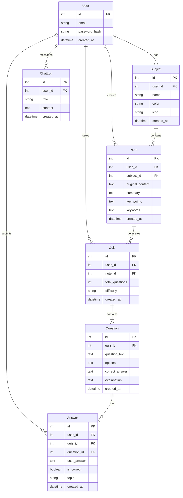

# 🗄️ DB DESIGN — 核心資料庫設計文件
> **文件版本**：v1.0  
> **建立日期**：2026-04-16

根據 PRD 與系統架構規範，本系統採用 SQLite 並透過 Flask-SQLAlchemy (ORM) 管理資料模型。以下為資料庫架構與表格設計。

---

## 1. 實體關係圖 (ER Diagram)

---

## 2. 資料表詳細說明

### 2.1 User (users)
儲存使用者基本資訊與認證資料。
| 欄位名稱 | 型別 | 必填 | 說明 |
|----------|------|------|------|
| `id` | INTEGER PK | Y | 系統唯一識別碼 |
| `email` | VARCHAR(255) | Y | 使用者信箱 (Unique) |
| `password_hash` | VARCHAR(255) | Y | 經 bcrypt 加密的密碼 |
| `created_at` | DATETIME | Y | 建立時間 |

### 2.2 Subject (subjects)
使用者建立的學習科目。
| 欄位名稱 | 型別 | 必填 | 說明 |
|----------|------|------|------|
| `id` | INTEGER PK | Y | 科目 ID |
| `user_id` | INTEGER FK | Y | 關聯至 User |
| `name` | VARCHAR(100) | Y | 科目名稱 (例如：物理、數學) |
| `color` | VARCHAR(50) | N | 科目標籤顏色 |
| `icon` | VARCHAR(50) | N | 科目圖示 |
| `created_at` | DATETIME | Y | 建立時間 |

### 2.3 Note (notes)
儲存使用者上傳的講義內容及 AI 產生的摘要。
| 欄位名稱 | 型別 | 必填 | 說明 |
|----------|------|------|------|
| `id` | INTEGER PK | Y | 筆記 ID |
| `user_id` | INTEGER FK | Y | 關聯至 User |
| `subject_id` | INTEGER FK | Y | 關聯至 Subject |
| `original_content` | TEXT | Y | 原文/OCR 解析文字 |
| `summary` | TEXT | Y | AI 段落摘要 |
| `key_points` | TEXT | N | JSON 格式重點條列 |
| `keywords` | TEXT | N | JSON 格式關鍵字標籤 |
| `created_at` | DATETIME | Y | 建立時間 |

### 2.4 Quiz (quizzes)
儲存 AI 基於筆記生成的測驗卷資訊。
| 欄位名稱 | 型別 | 必填 | 說明 |
|----------|------|------|------|
| `id` | INTEGER PK | Y | 測驗 ID |
| `user_id` | INTEGER FK | Y | 關聯至 User |
| `note_id` | INTEGER FK | Y | 關聯至 Note |
| `total_questions` | INTEGER | Y | 總題數 |
| `difficulty` | VARCHAR(20) | Y | 難易度 (easy, medium, hard) |
| `created_at` | DATETIME | Y | 建立時間 |

### 2.5 Question (questions)
儲存一份測驗卷中的個別題目。
| 欄位名稱 | 型別 | 必填 | 說明 |
|----------|------|------|------|
| `id` | INTEGER PK | Y | 題目 ID |
| `quiz_id` | INTEGER FK | Y | 關聯至 Quiz |
| `question_text` | TEXT | Y | 題目內容 |
| `options` | TEXT | N | 選擇題選項 (JSON array) |
| `correct_answer` | TEXT | Y | 正確解答 |
| `explanation` | TEXT | N | 答案解析 |
| `created_at` | DATETIME | Y | 建立時間 |

### 2.6 Answer (answers)
儲存使用者的每題作答記錄，包含弱點標籤以供分析。
| 欄位名稱 | 型別 | 必填 | 說明 |
|----------|------|------|------|
| `id` | INTEGER PK | Y | 作答 ID |
| `user_id` | INTEGER FK | Y | 關聯至 User |
| `quiz_id` | INTEGER FK | Y | 關聯至 Quiz |
| `question_id` | INTEGER FK | Y | 關聯至 Question |
| `user_answer` | TEXT | Y | 使用者填寫/選擇的答案 |
| `is_correct` | BOOLEAN | Y | 是否答對 |
| `topic` | VARCHAR(100) | Y | 此題的知識點 (用於弱點分析) |
| `created_at` | DATETIME | Y | 建立時間 |

### 2.7 ChatLog (chat_logs)
記錄使用者與 AI 的家教對話互動。
| 欄位名稱 | 型別 | 必填 | 說明 |
|----------|------|------|------|
| `id` | INTEGER PK | Y | 訊息 ID |
| `user_id` | INTEGER FK | Y | 關聯至 User |
| `role` | VARCHAR(20) | Y | 身份：user 或 ai |
| `content` | TEXT | Y | 訊息內容 |
| `created_at` | DATETIME | Y | 建立時間 |

---

## 3. SQL 建表與 Python Model 說明

- **建表語法**: `database/schema.sql` 提供原生 SQLite CREATE TABLE 語法參考。
- **資料模型**: 使用 SQLAlchemy 實作各表格操作，模型放在 `app/models/` 供專案引入使用，支援 CURD 方法 (如 `create`, `get_by_id`, `update`, `delete`)。
