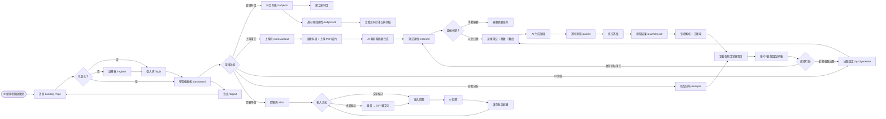
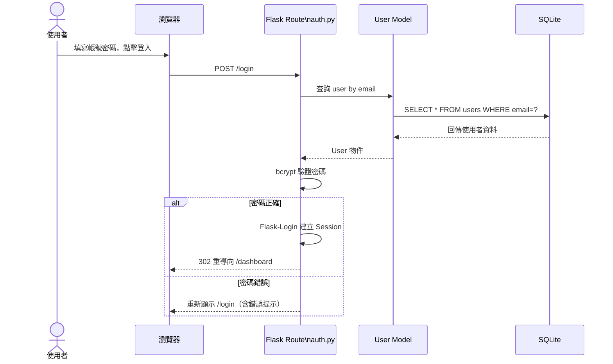
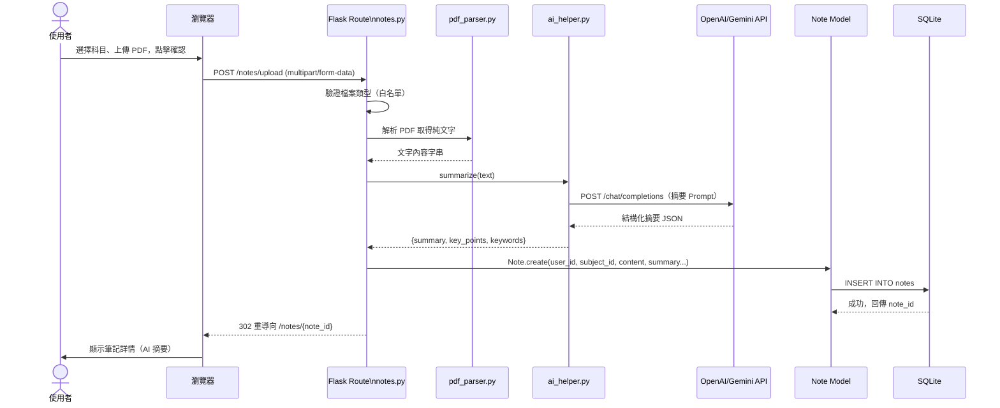
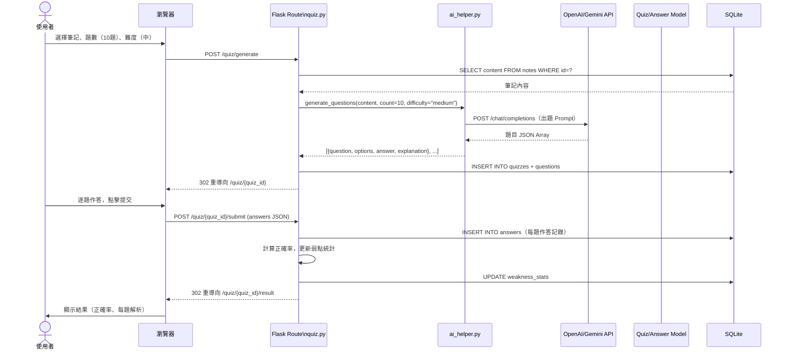
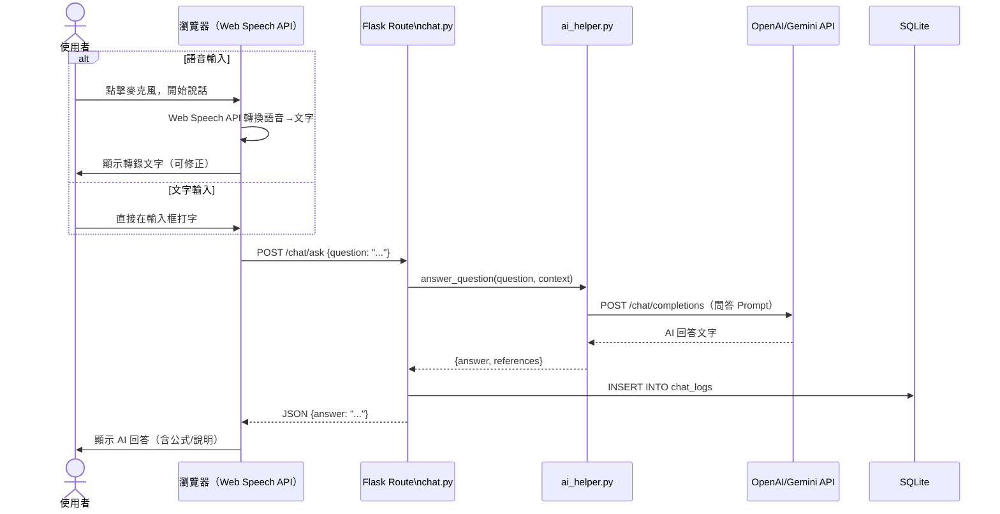
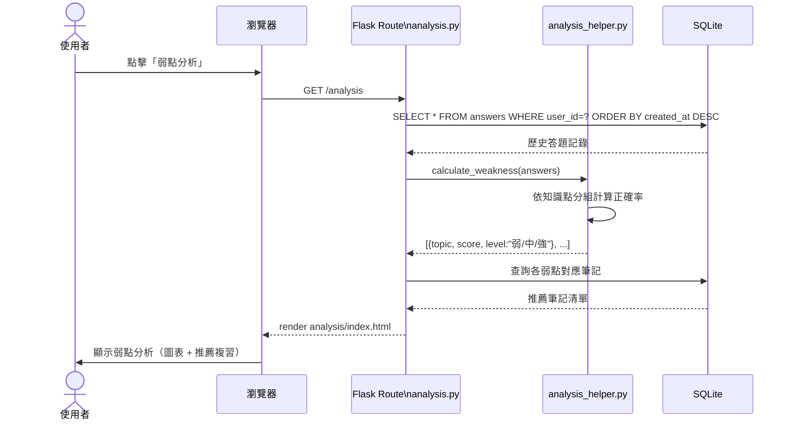

# 📊 FLOWCHART — AI 學習助理系統流程圖
> **文件版本**：v1.0  
> **建立日期**：2026-04-09  
> **對應文件**：docs/PRD.md、docs/ARCHITECTURE.md

---

## 1. 使用者流程圖（User Flow）

描述使用者從進入網站到完成各核心功能的完整操作路徑。

---

## 2. 系統序列圖（Sequence Diagrams）

### 2.1 使用者登入流程

---

### 2.2 上傳筆記與 AI 摘要流程

---

### 2.3 AI 出題與測驗批改流程

---

### 2.4 語音問答學習流程

---

### 2.5 弱點分析流程

---

## 3. 功能清單對照表

| # | 功能 | URL 路徑 | HTTP 方法 | 說明 |
|---|---|---|---|---|
| 1 | 首頁 | `/` | GET | Landing Page，未登入顯示介紹 |
| 2 | 註冊 | `/register` | GET / POST | 建立新帳號 |
| 3 | 登入 | `/login` | GET / POST | 帳號驗證與 Session 建立 |
| 4 | 登出 | `/logout` | POST | 清除 Session |
| 5 | 儀表板 | `/dashboard` | GET | 學習進度總覽 |
| 6 | 科目列表 | `/subjects` | GET | 顯示所有科目 |
| 7 | 建立科目 | `/subjects` | POST | 新增科目 |
| 8 | 科目詳情 | `/subjects/<id>` | GET | 該科目的筆記與測驗列表 |
| 9 | 上傳筆記 | `/notes/upload` | GET / POST | 上傳 PDF 並觸發 AI 摘要 |
| 10 | 筆記詳情 | `/notes/<id>` | GET | 顯示 AI 摘要與原文 |
| 11 | 編輯筆記 | `/notes/<id>/edit` | GET / POST | 手動編輯摘要 |
| 12 | 刪除筆記 | `/notes/<id>/delete` | POST | 刪除筆記 |
| 13 | 出題設定 | `/quiz/generate` | GET / POST | 設定題數、難度，觸發 AI 出題 |
| 14 | 進行測驗 | `/quiz/<id>` | GET | 顯示題目 |
| 15 | 提交答案 | `/quiz/<id>/submit` | POST | 批改並計算正確率 |
| 16 | 測驗結果 | `/quiz/<id>/result` | GET | 顯示結果與解析 |
| 17 | 弱點分析 | `/analysis` | GET | 顯示弱點圖表與複習建議 |
| 18 | 問答頁面 | `/chat` | GET | 語音/文字問答介面 |
| 19 | 提問 API | `/chat/ask` | POST | 接收問題，回傳 AI 回答（JSON） |

---

*📌 下一步：請繼續使用 **/db-design** skill 設計資料庫 Schema。*
